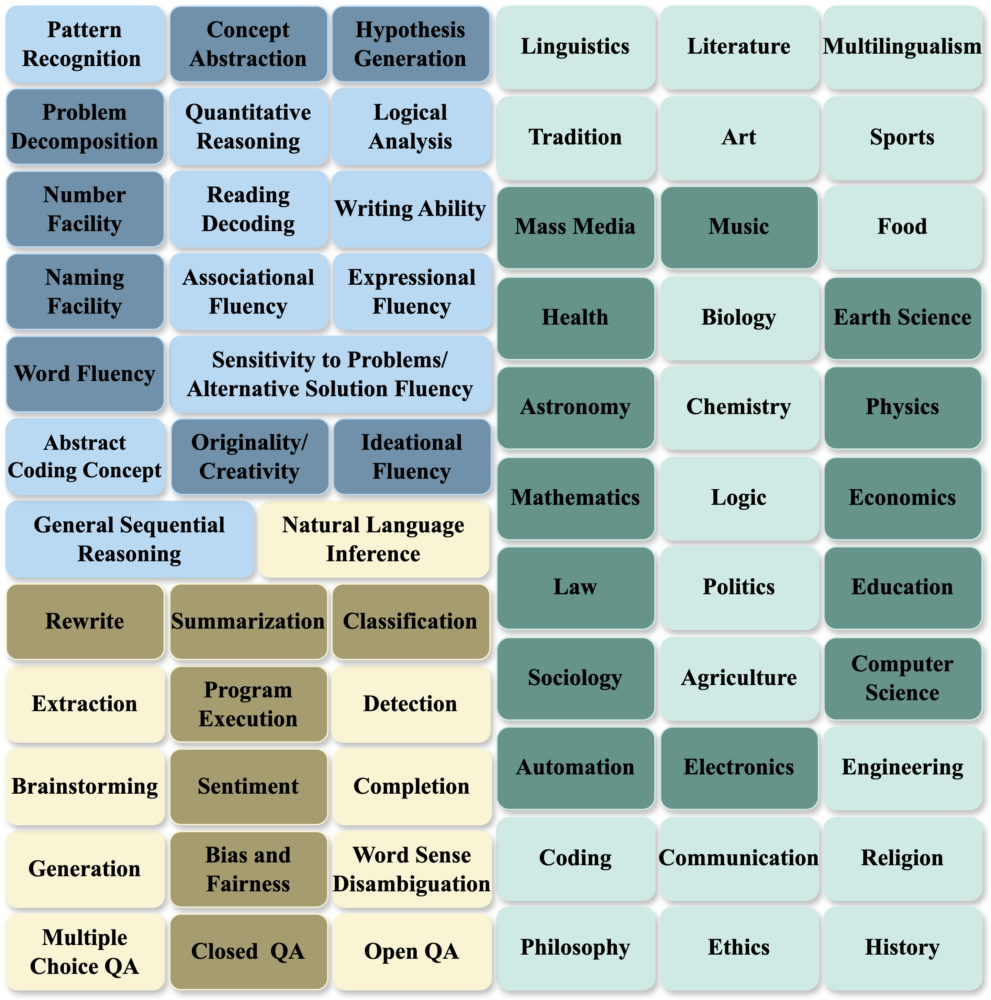

# CDT
This repository provides an open-source implementation of the paper **CDT: A Comprehensive Capability Framework for Large Language Models Across Cognition, Domain, and Task.** It includes methods for annotating datasets with capability tags across the three dimensions and for selecting data in general and specific scenarios.

    

## Directory Structure

- **[tag_annotate](tag_annotate)**: This folder contains the core components for tagging instructions based on the CDT framework.
  - **Prompt Files**: Prompts used by the tag annotator.
  - **Tagging Code**: Python scripts responsible for annotating instructions with capability tags.
  - **Tag Post-Processing**: Code for cleaning and refining the tags after they’ve been assigned.

- **[data_selection](data_selection)**: This folder includes methods for data selection in general and specific scenarios.
  - **General Scenario Selection**: Code for general scenario data selection.
  - **Special Scenario Selection**: Code for specific scenario data selection.

## How to Use

1. **Tagging Instructions**: To annotate a dataset, use the code provided in the `tag_annotate` folder. First, execute the Python script `annotate.py` to assign capability tags to the datasets. Next, run the script `postprocess_tag.py` to clean and refine the annotations. Finally, execute `combine_tags.py` to combine all the tags across the three dimensions: cognition, domain, and task.
   
2. **Data Selection**: Use the scripts in the `data_selection` folder to apply data selection methods. `diversity.py` selects data for general scenarios based on diversity, and `specific.py` selects data for specific scenarios based on the capability tags in validation set.

